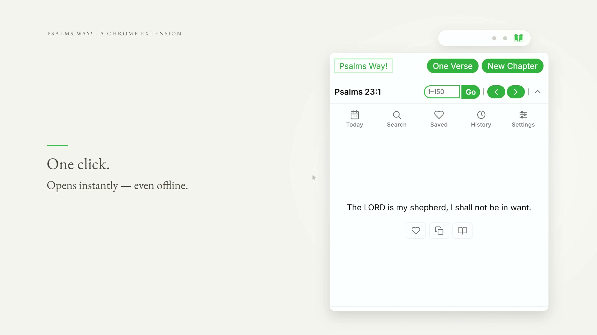

# Psalms Way!

**A Biblical pause before new beginnings. All 150 Psalms in the browser toolbar, with no network access.**

▶ Watch the launch video

---

Psalms Way! puts all 150 Psalms in a browser popup. The full text is bundled with the
extension, so it opens instantly and works with the network disconnected. There is no account,
no server, and no request of any kind.

## Project status

- **Chrome Web Store:** [live](https://chromewebstore.google.com/detail/psalms-way-biblical-begin/aplafmlmecdjlmcgbibmlbjnilcomcnl), version 1.1.
- **Stack:** plain HTML, CSS, and JavaScript. Manifest V3, no build step, no dependencies.
- **Text:** 150 chapters, English (NIV), bundled as a 228 KB JSON file.
- **Licence:** [MIT](LICENSE) for the source. The bundled text keeps its own terms.

There is also a companion [Android app](https://github.com/atj393/psalms-way-app) with a much
larger translation set.

## What it does

| Feature | Detail |
|---|---|
| **Today's Psalm** | A chapter derived from the current date, so it is the same for the whole day. |
| **Random verse** | One verse, drawn at random. |
| **Random chapter** | A full chapter, drawn at random. |
| **Chapter navigation** | Previous, next, or jump straight to a chapter number. |
| **Search** | Keyword search across all 150 chapters, with matches highlighted in the results. |
| **Favourites** | Save verses and remove them again from a dedicated panel. |
| **History** | Recently viewed chapters, with a clear-history action. |
| **Copy** | Copy any verse with its reference. |
| **Appearance** | Light and dark themes, adjustable font size, and a collapsible toolbar. All persisted. |

## Install

- **Chrome and Edge:** [Chrome Web Store listing](https://chromewebstore.google.com/detail/psalms-way-biblical-begin/aplafmlmecdjlmcgbibmlbjnilcomcnl)
- **From source:**
  1. Clone this repository.
  2. Open `chrome://extensions` and enable **Developer mode**.
  3. Click **Load unpacked** and select the cloned folder.

  There is nothing to build and no dependencies to install.

See [USER_GUIDE.md](USER_GUIDE.md) for a walkthrough of each panel.

## Privacy

The extension requests exactly one permission, `storage`, and uses `chrome.storage.local` to
keep your favourites, history, theme, font size, and toolbar state on your own machine.

- No network requests. The Psalms text is bundled in `psalms.json`.
- No host permissions, so the extension cannot read any page you visit.
- No analytics, no accounts, no telemetry.

## How it is built

Four files do the work: `manifest.json`, `popup.html`, `popup.js`, and `style.css`, plus the
bundled `psalms.json`.

Two decisions are worth calling out.

**The text is bundled, not fetched.** A 228 KB JSON file ships inside the extension. That makes
the package larger than a fetch-on-demand design, and in exchange the popup renders with no
latency, no failure mode when offline, and no host permission to justify to reviewers or to
users. For a popup that exists to be opened in a spare moment, a spinner would defeat the point.

**Today's Psalm is derived, not stored.** `getDailyChapterIndex()` computes the chapter from the
current date rather than saving a "chapter of the day" record. Nothing has to be scheduled,
nothing expires, and two devices with the same date agree without any sync.

## Known limitations

- **English only in practice.** The settings panel lists Spanish, French, German, and
  Portuguese, but all four are disabled and marked "coming soon". Only English (NIV) is shipped.
- **No tests.** There is no automated suite.
- **Favourites and history are per-browser-profile**, held in `chrome.storage.local`. They do
  not sync between devices and are lost if the extension is removed.

## Contributing

Contributions are welcome. See [CONTRIBUTING.md](CONTRIBUTING.md) and the
[Code of Conduct](CODE_OF_CONDUCT.md).

To test a change, load the unpacked extension as described above, then reload it from
`chrome://extensions` after each edit.

## Feedback and support

- [Open an issue](https://github.com/atj393/psalms-way-browser-extension/issues)
- [Feedback form](https://docs.google.com/forms/d/e/1FAIpQLSda0j_4GX_E_aFhsyItJssbgRc6C7Ukg-No54Gc0Sivzt5iSA/viewform?usp=sf_link)

## Licence

Extension source code is released under the [MIT License](LICENSE), which permits personal and
commercial use, modification, and redistribution, provided the copyright and licence notice are
kept.

The Psalms text bundled in `psalms.json` is **not** covered by that licence and remains under its
own respective terms.
