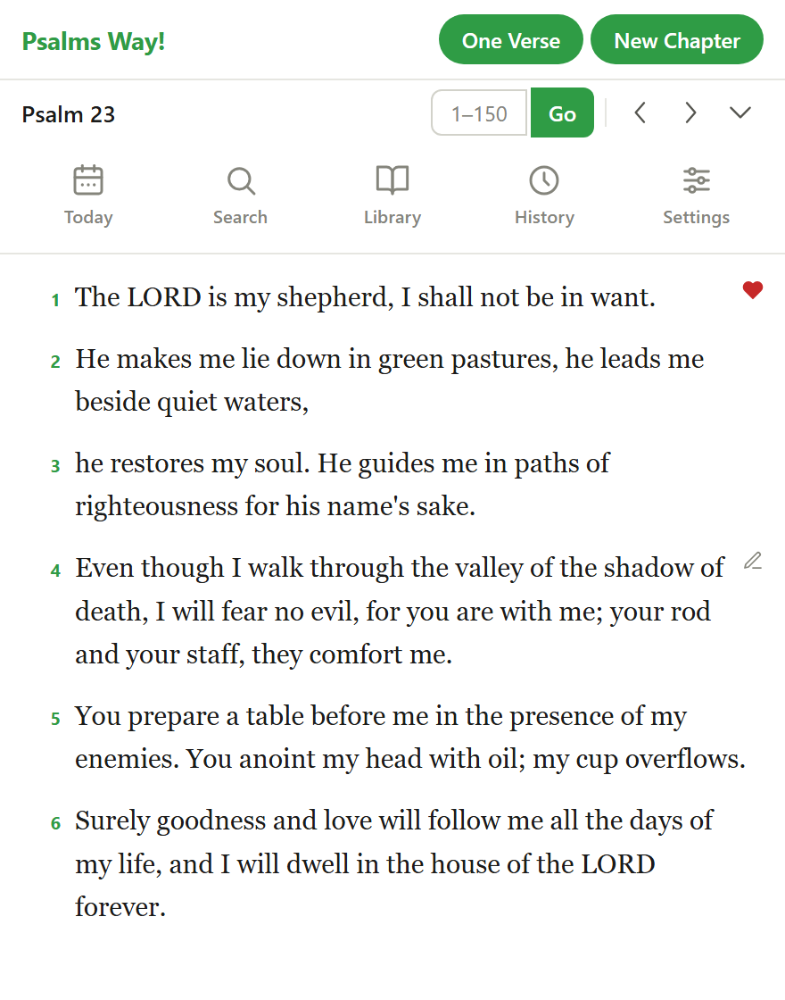
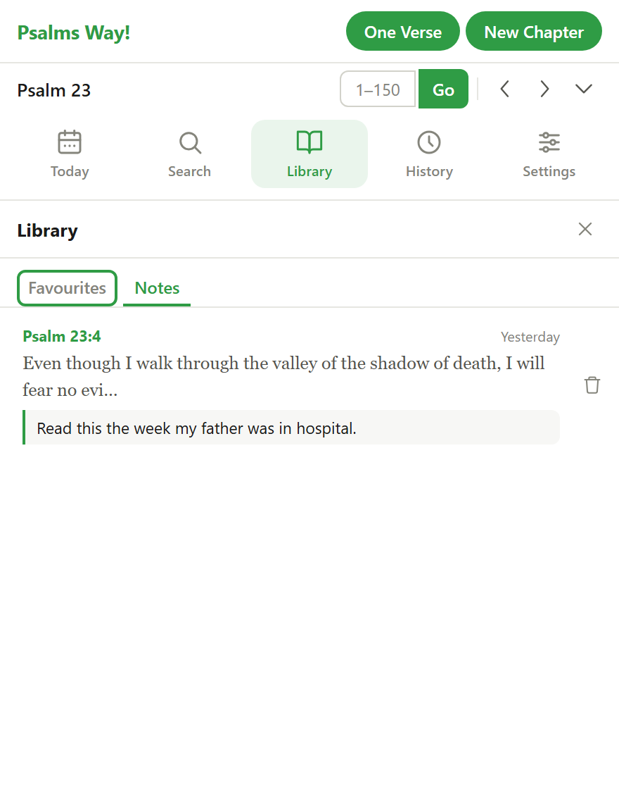
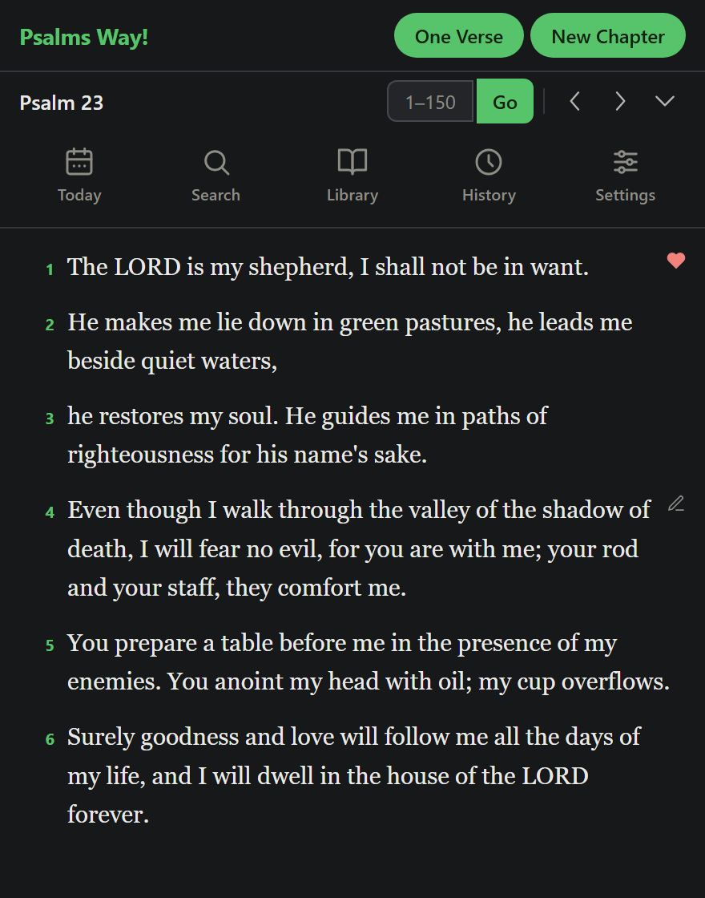

<div align="center">


# Psalms Way!

**A Biblical pause before new beginnings. All 150 Psalms in the browser toolbar, with no network access.**

[](https://github.com/atj393/psalms-way-browser-extension/actions/workflows/ci.yml)
[](https://chromewebstore.google.com/detail/psalms-way-biblical-begin/aplafmlmecdjlmcgbibmlbjnilcomcnl)
[](LICENSE)
[](manifest.json)
[](#privacy)

</div>

---

Psalms Way! puts all 150 Psalms in a browser popup. The full text is bundled with
the extension, so it opens instantly and works with the network disconnected. There
is no account, no server, and no request of any kind.

<div align="center">





</div>

## What it does

**Reading**

- **Today's Psalm** — one chapter per calendar day, the same all day, derived from
  the date rather than stored.
- **Random verse** and **random chapter**.
- Previous, next, or jump straight to a chapter number.
- Select any verse to save it, note it, or copy it.
- Reopens where you left off.

**Your library**

- **Favourites** — save any verse and find it again.
- **Notes** — write a short note on a verse, edit it, delete it, and jump back to
  the verse from the Library.
- **History** — recently read passages, newest first.

**Finding things**

- Keyword search across all 150 chapters, with matches highlighted and the count
  reported. Results open the exact verse that matched.

**Appearance**

- Light, sepia and dark themes; three text sizes; a collapsible toolbar. All
  remembered.

**Your data**

- Export everything to a JSON file and restore it on another browser or profile.

## Install

- **Chrome and Edge:** [Chrome Web Store listing](https://chromewebstore.google.com/detail/psalms-way-biblical-begin/aplafmlmecdjlmcgbibmlbjnilcomcnl)
- **From source:**
  1. Clone this repository.
  2. Open `chrome://extensions` and enable **Developer mode**.
  3. Click **Load unpacked** and select the cloned folder.

  There is nothing to build. `npm install` is only needed to run the tests.

See [USER_GUIDE.md](USER_GUIDE.md) for a walkthrough of each panel.

## Privacy

The extension requests exactly one permission, `storage`.

- **No network requests of any kind.** The Psalms text is bundled in
  `psalms.json`. Export and restore read and write a local file you choose; they
  do not upload anything. The browser smoke test fails the build if the popup
  makes any request at all.
- **No host permissions and no content scripts**, so the extension cannot see,
  read or modify any page you visit. `scripts/validate-manifest.js` fails the
  build if either is ever added.
- **No analytics, no accounts, no telemetry.**
- Favourites, notes, history and settings are held in `chrome.storage.local` on
  your own machine. They are not synced and are removed if you uninstall the
  extension — export a backup first if you want to keep them.

## How it is built

Plain HTML, CSS and JavaScript. Manifest V3, no framework, no bundler, no runtime
dependencies, and no build step: the files in the repository are the files that
ship.

```
manifest.json     popup.html     style.css     psalms.json
src/
  app.js          bootstrap, view switching, focus management
  reader.js       the reading view
  panels.js       search, Library and history lists
  notes.js        the note editor
  settings.js     appearance, export and restore
  storage.js      the only module that touches chrome.storage
  backup.js       versioned export format and import validation
  search.js       search and match segmentation
  data.js         bundled text, references, ranges
  dates.js        Today's Psalm
  dom.js          element helpers, status line, dialog
  icons.js        SVG icons
```

Four decisions are worth calling out.

**The text is bundled, not fetched.** A 224 KB JSON file ships inside the
extension. That makes the package larger than a fetch-on-demand design, and in
exchange the popup renders with no latency, no failure mode when offline, and no
host permission to justify to reviewers or to users.

**Today's Psalm is derived, not stored.** The chapter is computed from the current
date, so nothing has to be scheduled and nothing expires. It is computed from the
local calendar date via `Date.UTC()` rather than by dividing a millisecond
difference, because a local day is 23 or 25 hours long on a daylight-saving
transition and the obvious arithmetic drifts.

**One module owns storage.** Everything reads and writes through `src/storage.js`,
which holds the defaults, validates every record on the way in, migrates older
data, and — importantly — lets a failed write fail loudly instead of leaving the
UI showing something that was never saved.

**Backup is a file, not a cloud.** `chrome.storage.sync` allows roughly 100 KB in
total and 8 KB per item; notes are free text, so syncing them would eventually
start failing writes. Export and restore have no quota, need no account, and keep
the extension entirely offline.

## Development

```bash
npm install

npm test              # 146 unit and DOM tests
npm run test:coverage # coverage for the service layer
npm run test:browser  # loads the real extension into Chrome and drives the popup
npm run lint
npm run validate      # Psalm data, manifest and package contents
npm run package       # builds dist/psalms-way-extension.zip
npm run check         # lint + validate + test
```

`npm run test:browser` needs Chrome. It is found automatically on the usual paths;
otherwise set `CHROME_PATH`. Add `--headful` to watch it run.

CI runs lint, formatting, all three validators, coverage, the browser smoke test
against the packaged build, and the date tests in six time zones.

To reload after an edit: `chrome://extensions` → the refresh icon on the card.

## Supported browsers

Tested on **Chrome** (Manifest V3) and expected to work on Chromium-based
browsers including **Edge**, which uses the same extension APIs. The only browser
API used is `chrome.storage.local`.

Firefox is **not** supported: it would need a `browser_specific_settings` key and
its own testing, neither of which has been done.

## Companion app

There is also an [Android app](https://github.com/atj393/psalms-way-app) with a
much larger translation set. The two products share their vocabulary — Psalm,
Library, Notes, History — but not their feature set: the extension is deliberately
the smaller, faster, offline-only one. Where they differ on purpose, it is written
down in [docs/OVERNIGHT_AUDIT.md](docs/OVERNIGHT_AUDIT.md).

## Contributing

Contributions are welcome. See [CONTRIBUTING.md](CONTRIBUTING.md) and the
[Code of Conduct](CODE_OF_CONDUCT.md). Please run `npm run check` before opening a
pull request.

## Feedback and support

- [Open an issue](https://github.com/atj393/psalms-way-browser-extension/issues)
- [Feedback form](https://docs.google.com/forms/d/e/1FAIpQLSda0j_4GX_E_aFhsyItJssbgRc6C7Ukg-No54Gc0Sivzt5iSA/viewform?usp=sf_link)

## Licence

Extension source code is released under the [MIT License](LICENSE), which permits
personal and commercial use, modification, and redistribution, provided the
copyright and licence notice are kept.

**The Psalms text bundled in `psalms.json` is not covered by that licence.** It is
an English NIV text and remains under its own respective terms. The MIT licence
applies to the code in this repository only, and redistributing the text is not
granted by it.
